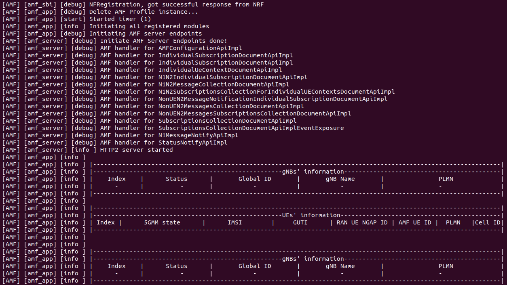
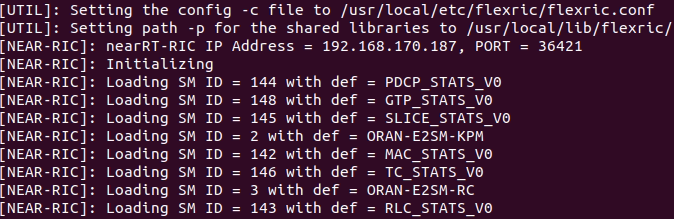
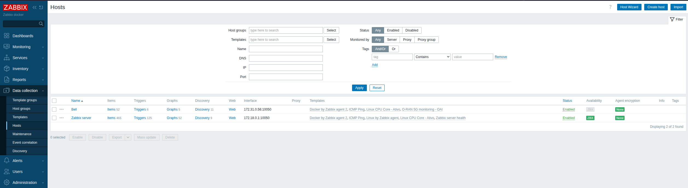
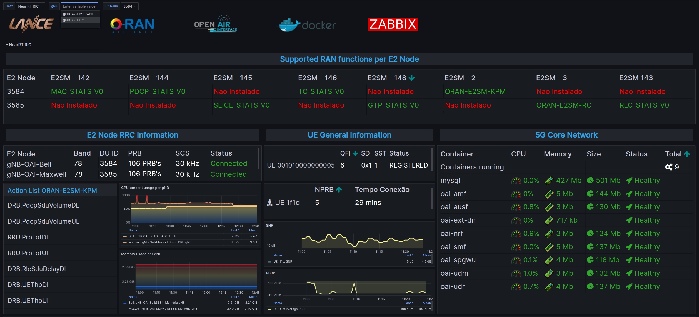

# 📡 Monitoramento Unificado de Multiplataformas E2 em Sistemas Open RAN

- Este repositório fornece um arcabouço para **monitoramento unificado de E2 Service Models (E2SMs)** em arquiteturas O-RAN. A solução integra **Zabbix**, **Grafana** e **scripts personalizados**, permitindo descoberta e visualização contínua dos E2SMs disponíveis na rede. Isso facilita o desenvolvimento de xApps e a configuração de testbeds, oferecendo visibilidade em tempo real sobre as capacidades da rede O-RAN.

 - Também estão incluídas ferramentas para **deploy, gerenciamento e automação** de componentes do ecossistema **OpenAirInterface (OAI)**, como EPC 4G, Core 5G, RANs, FlexRIC e xApps.

## 🔧 Arquitetura de Monitoramento


---

> A solução pode ser implantada de forma **monolítica ou distribuída**. No cenário demonstrado, distribuído, o testbed utiliza **4 máquinas físicas**:


| Host | IP             | Função               |
|------|----------------|----------------------|
| 1    | 172.31.0.61    | Zabbix Server        |
| 2    | 192.168.70.178 | OAI 5GC + RIC        |
| 3    | 172.31.0.54    | E2 Node gNB Maxwell  |
| 4    | 172.31.0.56    | E2 Node gNB Bell     |

---

## 📐 Arquitetura do Testbed


---

## 🖥 Requisitos

- Ubuntu 20.04 ou 22.04 (preferência por 20.04)
- Acesso `sudo`
- Ambiente gráfico ou suporte a `tmux`
- `gnome-terminal` (ou `x-terminal-emulator` como fallback)

---

## ⚙️ Etapas de Deployment

### 1. Ferramentas de Deployment (OpenAirInterface)

Clone o repositório e acesse a pasta:

```bash
git clone https://github.com/PauloBigooD/O-RAN_Monitoring.git
cd  O-RAN_Monitoring
```

O script `oai_tools_menu.sh` oferece um **menu interativo** com diversas opções para instalação, execução, logs e gerenciamento dos componentes do OAI.

---

### 📋 Funcionalidades do Menu

| Opção | Ação                                                |
|-------|-----------------------------------------------------|
| 1     | Instalar Docker e UHD 🛠                             |
| 2     | Instalar libuhd 4.4–4.7 📡                          |
| 3     | Ativar modo performance 🚀                          |
| 4     | Instalar dependências do 5GC e RAN                  |
| 5     | Instalar dependências do EPC 4G e RAN               |
| 6–12  | Gerenciar Core 5G e EPC 4G                          |
| 13–18 | Instalar/Iniciar FlexRIC, E2 Agent, gNB, UE, xApps  |
| 19–25 | Inicialização de gNBs/eNBs (Docker e Bare Metal)   |

---

### 2. Execução Recomendada Inicial

Antes de iniciar o deploy completo, recomenda-se executar:

```bash
1) Instalar Docker e UHD
2) (opcional) Instalar libuhd 4.4–4.7
3) Ativar modo performance
```

---

##  🏗️ Deploy do Core 5G (5GC)

### 3.1 Monolítico

```bash
4) Dependências 5GC e RAN
6) Iniciar Core 5G Monolítico
8) Logs Core 5G - AMF
```



---

### 3.2 Distribuído
> Essas configurações devem ser aplicadas quando queremos que o CORE receba conexões de gNBs externas.

**Criar interface mac-vlan**:
> Os endereços IPs a seguir devem ser configurados conforme as especificações da rede local.
- --subnet= Endereço da rede do Host - (aqui: 192.168.170.0/24)
- --gateway= Gatewai da rede do Host - (aqui: 192.168.170.1)
- parent= Nome da interface de rede do Host - (aqui: enp3s0)

```bash
sudo docker network create -d macvlan --subnet=192.168.170.0/24 --gateway=192.168.170.1 -o parent=enp3s0 macvlan-dhcp
```

**Ajustar endereços IP do Docker-Compose**

> Após realizar a configuração da interface `macvlan` é necessário conferir os IPs de cada uma das funções de rede do arquivo `docker-compose-basic-nrf-macvlan.yaml` localizado dentro da pasta `core-scripts`. Após realizar os ajustes salve o arquivo.

>> Todos os IPs devem ser ajustados para endereços IP disponíveis na mesma faixa da sua rede.

>>> ⚠️ Note que alguns IPs aparecem mais de uma vez. Realize o procedimento de substituição com muito cuidado!

 **Para este deployment foram utilizados os seguintes endereços IP**:

| VNF         | IP
| ----------- | ---------------
|oai-amf      | 192.168.170.178
|oai-nrf      | 192.168.170.179
|oai-udr      | 192.168.170.180
|oai-udm      | 192.168.170.181
|oai-ausf     | 192.168.170.182
|oai-smf      | 192.168.170.183
|oai-spgwu    | 192.168.170.184
|trf-gen-cn5g |192.168.170.185
|mysql        | 192.168.170.186

**Ajustar endereços IP do arquivo amf.conf**

> Outro arquivo que exige o ajuste dos IPs é o `amf.conf` localizado em `core-scripts/etc`, os IPs devem ser configurados de acordo com os configurados no passo anterior. Após realizar os ajustes salve o arquivo.

 **Para este deployment foram utilizados os seguintes endereços IP**:

```
      SMF_INSTANCES_POOL = (
        {SMF_INSTANCE_ID = 1; IPV4_ADDRESS = "192.168.170.183"; PORT = "80"; HTTP2_PORT = 8080, VERSION = "v1"; FQDN = "oai-smf", SELECTED = "true"}
      );

    NRF :
    {
      IPV4_ADDRESS = "192.168.170.179";
      PORT         = 80;            # Default: 80
      API_VERSION  = "v1";
      FQDN         = "oai-nrf"
    };

    AUSF :
    {
      IPV4_ADDRESS = "192.168.170.182";
      PORT         = 80;            # Default: 80
      API_VERSION  = "v1";
      FQDN         = "oai-ausf"
    };

    UDM :
    {
      IPV4_ADDRESS = "192.168.170.181";
      PORT         = 80;    # Default: 80
      API_VERSION  = "v2";
      FQDN         = "oai-udm"
    };

    AUTHENTICATION:
    {
        ## MySQL mandatory options
        MYSQL_server = "192.168.170.186"; # MySQL Server address
        MYSQL_user   = "root";   # Database server login
        MYSQL_pass   = "linux";   # Database server password
        MYSQL_db     = "oai_db";     # Your database name
        RANDOM = "true";
    };
```
**Após isso:**

```bash
7) Iniciar Core 5G Distribuido
10) Parar Core 5G
```

---

## 🧠 Near-RT RIC

> ⚠️ Esse processo o faz rebuild dos componentes da RAN e pode levar alguns minutos.

### 4.1 Monolítico

```bash
12) Instalar FlexRIC
13) Iniciar nearRT-RIC
```


### 4.2 Distribuído

> O proximo passo é adcionar um IP à interface de rede local, este será o novo IP do Near-RT RIC. 

```bash
sudo ip addr add 192.168.170.187/24 dev enp3s0
```

> Após adicionar o IP edite o arquivo `flexric/flexric.conf`, este será o novo IP do Near-RT RIC. Após realizar os ajustes salve o arquivo.

```bash
[NEAR-RIC]
NEAR_RIC_IP = 192.168.170.187 # Substitua pelo IP que foi adicionado a interface local
```

**Build Near-RT RIC manualmente**

> Para rebuildar devemos remover a pasta `flexric/build`

```bash
sudo rm -rf flexric/build
```
> Rebuild o FlexRIC

```bash
mkdir flexric/build
cd flexric/build && sudo cmake .. && sudo make -j8 && sudo make install && cd ../..
```

**Iniciar Near-RT RIC**

```bash
13) Iniciar nearRT-RIC
```


---

## 📡 RAN (E2 Node)

### 5.1 Monolítico

> ⚠️ Se o Core 5G e a RAN estiverem na mesma máquina, apenas execute:

```bash
15) Iniciar gNB rfsim
```

### 5.2 Distribuído

> Hosts dedicados à RAN:

```bash
1) Instalar Docker e UHD
3) Modo performance
12) Instalar FlexRIC
```

**Ajuste de IPs**

Verifique os arquivos de configuração na pasta `conf/b210PRB106.conf` para ajustar os IPs conforme seu ambiente:

```conf
amf_ip_address = ( { ipv4 = "192.168.170.178"; ... } ); # Iforme o IP do AMF

NETWORK_INTERFACES:
{
    GNB_INTERFACE_NAME_FOR_NG_AMF = "enp3s0"; # Deve ser a mesma do computador local
    GNB_IPV4_ADDRESS_FOR_NG_AMF   = "192.168.170.78/24"; # Mesmo IP da interface local
    ...
};

e2_agent = {
  near_ric_ip_addr = "192.168.170.187"; # Deve ser o mesmo IP que foi atribuído ao Near-RT RIC
  #sm_dir = "/path/where/the/SMs/are/located/"
  sm_dir = "/usr/local/lib/flexric/"
};
```

> ⚠️ Certifique-se de ajustar `eth0` e os IPs para as interfaces reais do host nos casos de deploy bare metal.

**Iniciar gNB**

> Selecione uma das seguintes opções:

```bash
18) Iniciar gNB n310 106 PRBs (Bare Metal)
19) Iniciar gNB n310 162 PRBs (Bare Metal)
20) Iniciar gNB n310 273 PRBs (Bare Metal)
21) Iniciar gNB b210 106 PRBs (Bare Metal)
22) Iniciar gNB b210 106 PRBs (Docker 🐳)
```
> ⚠️ Por questões de estabilidade, recomenda-se a seleção da opção 21 `gNB b210 106 PRBs (Bare Metal)`

---

## 📊 Monitoramento com Zabbix & Grafana

> ⚠️ É recomendado dedicar um Host ou uma Máquina Virtual para a instalação do Zabbix Server.

### 6.1 Instalar Zabbix Server

#### Alterne para o seguinte diretório:

```bash
cd zabbix/zabbix-server-docker
```

> Caso o Host não tenha o Docker instalado utilize o script `install-docker.sh` e realize a instalação.

```bash
sudo docker compose up -d
```

> Após executar o deployment do docker-compose as APIs do Zabbix e Grafana estarão disponíveis no IP local da Host. O acesso é feito a partir do navegador WEB.


`Zabbix: 192.168.170.78`

`Username: Admin`

`Password: zabbix`


---

`Grafana: 192.168.170.78:3000`

`Username: admin`

`Password: Grafana`

#### Dashboard Zabbix Server


### 6.2 Instalar Zabbix Agent

> A instalação do Zabbix Agent deve ser realizada nos Hosts onde o 5GC foi instalado e no E2 Node. Para instalar o Zabbix Agent é bem simples, basta alternar para `zabbix/zabbix-agent` e executar o script `install_zabbix_agent2.sh`


```bash
cd zabbix/zabbix-agent
```

> --hostname = Nome do Host/5GC/E2 Node, que desejamos monitorar

```bash
sudo ./install_zabbix_agent2.sh --hostname "HOST_NAME" --server "IP_ZABBIX-SERVER" --metadata "O-RAN"
```

> Após a instalação do Zabbix Agent o Host estará disponível no Zabbix Server

### Zabbix Hosts


> Agora também já é possível acompanhar as informações na dashboardo do Grafana

### Dashboard E2 Node



> Com o sistema de monitoramento desenvolvido, é possível visualizar os E2SMs suportados por cada nó E2, uma informação essencial para o desenvolvimento de xApps capazes de explorar plenamente as capacidades oferecidas pela infraestrutura disponível. Os resultados obtidos evidenciam que os componentes utilizados na solução de monitoramento — Zabbix, Grafana e scripts customizados — foram eficazes na coleta e armazenamento periódico das KPIs de interesse, viabilizando a visualização integrada do comportamento dos diversos elementos da rede.

---

## 📬 Contato

- 📧 Email: [paulo.eduardo.093@ufrn.edu.br](mailto:paulo.eduardo.093@ufrn.edu.br)
- 💼 LinkedIn: [paulo-eduardo-5a18b3174](https://linkedin.com/in/paulo-eduardo-5a18b3174)
- 💻 GitHub: [@PauloBigooD](https://github.com/PauloBigooD)

---

## 🙌 Contribuições

Contribuições são bem-vindas! Sinta-se à vontade para abrir uma [issue](https://github.com/PauloBigooD/O-RAN_Monitoring/issues) ou enviar um pull request com melhorias, correções ou novos módulos.