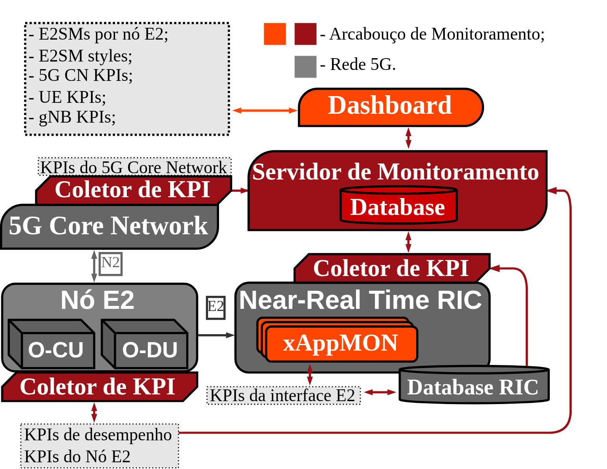
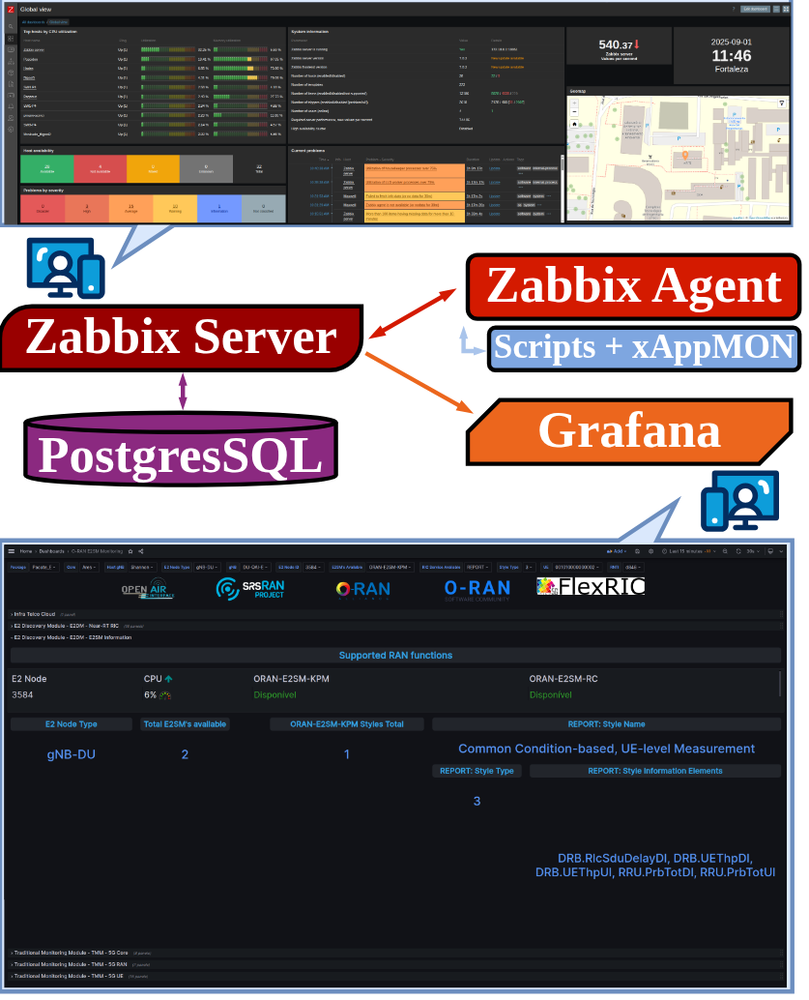
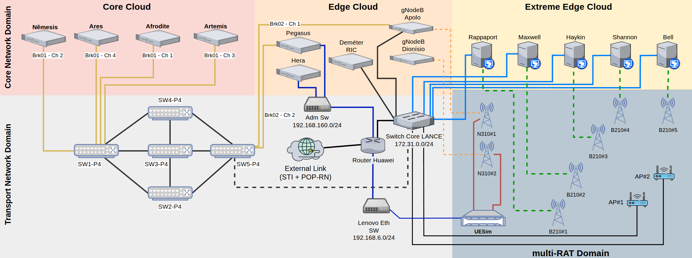
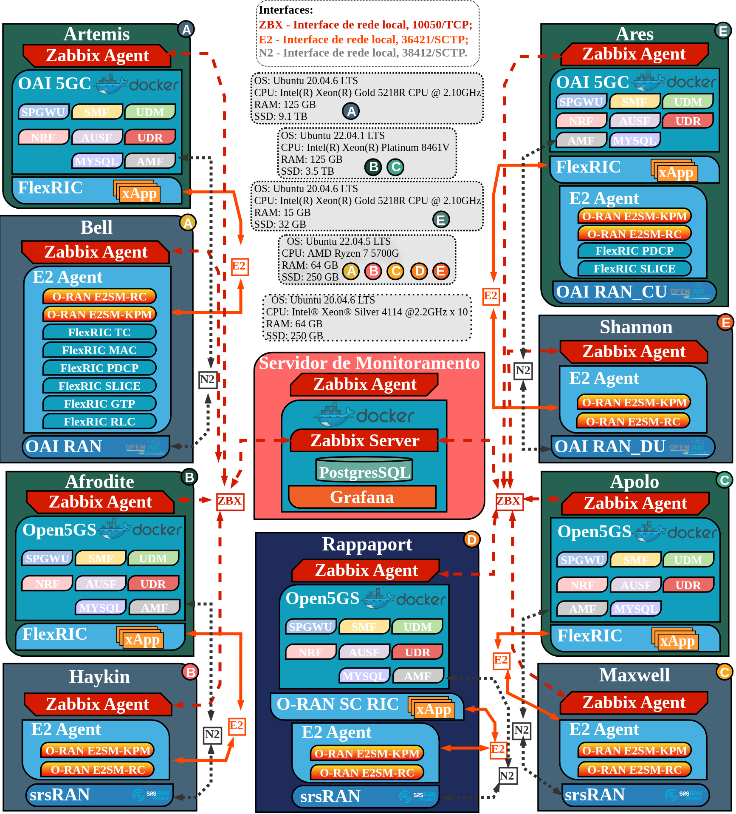
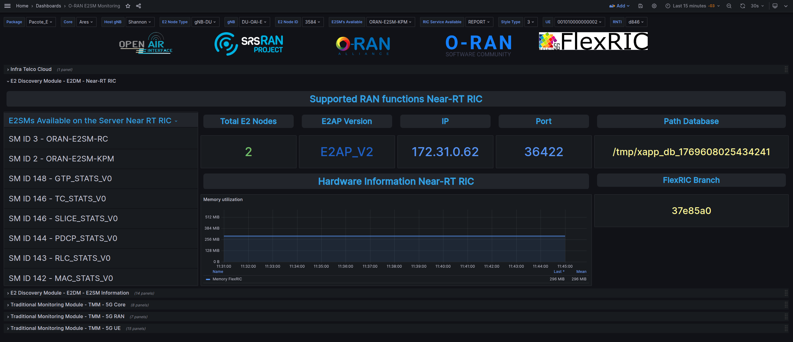
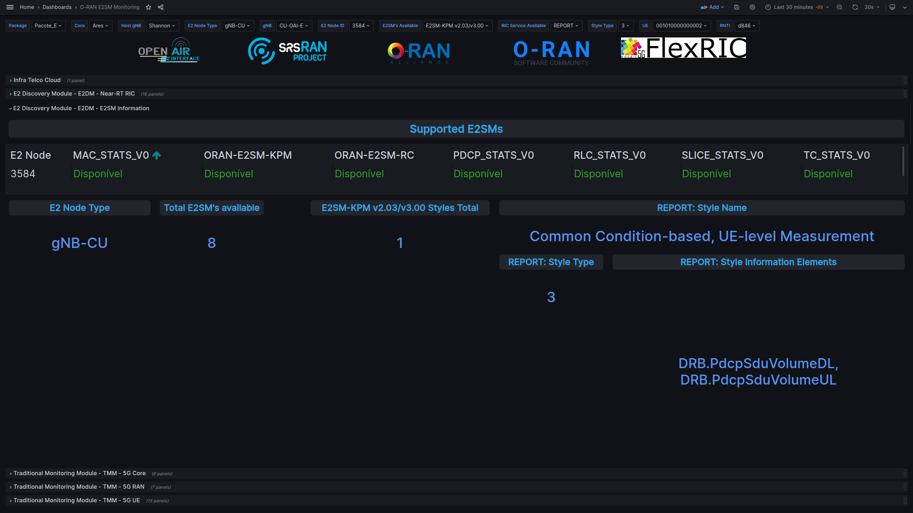
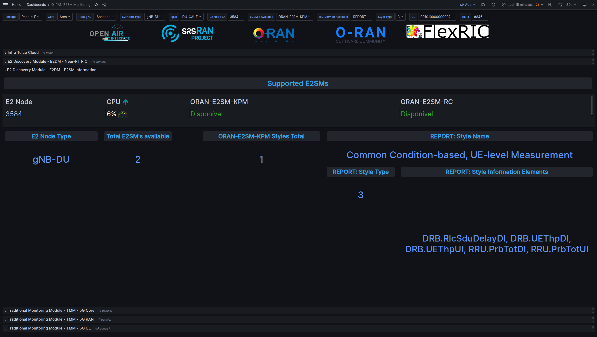
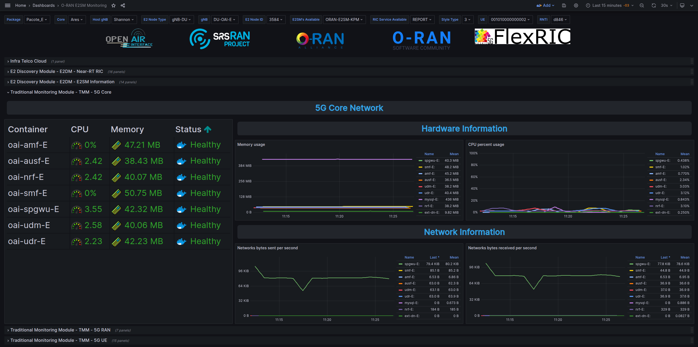
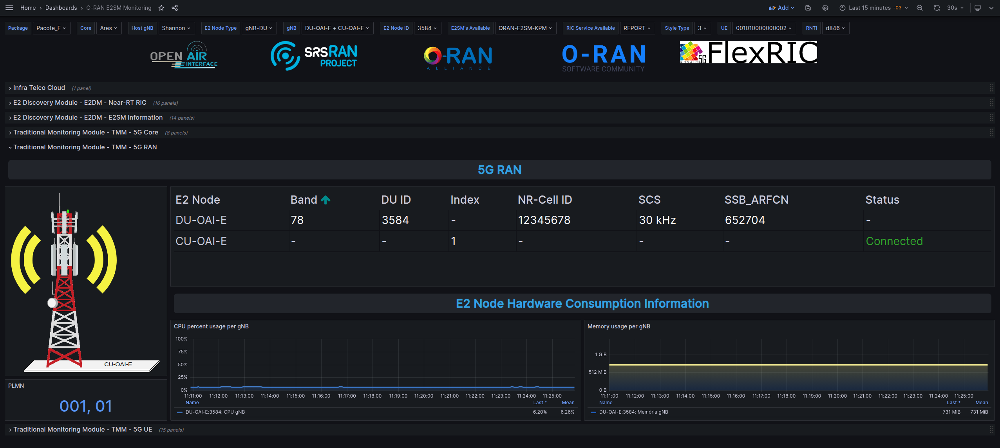
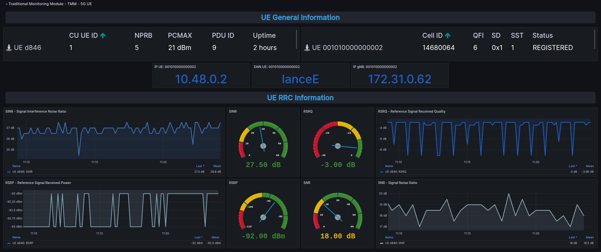

# 📡 Monitoramento Unificado de Multiplataformas E2 em Sistemas Open RAN

<div style="text-align: justify">

-  Este repositório fornece uma solução para a descoberta e o monitoramento de **E2 Service Models** (E2SMs) implantados em estações rádio-base (gNBs) de redes móveis de quinta geração (5G) baseadas na arquitetura **Open RAN**. As informações identificadas são encaminhadas a um servidor de monitoramento, onde são coletadas, organizadas e armazenadas de forma estruturada e periódica, possibilitando sua disponibilização por meio de um painel de visualização (dashboard) customizado. O monitoramento é direcionado aos nós **E2** da arquitetura **Open RAN**, que se comunicam por meio da interface padronizada **E2**. Embora essa interface seja especificada pela **O-RAN Alliance**, sua implementação apresenta elevado grau de flexibilidade e admite diferentes níveis de customização por parte dos fabricantes de gNBs, particularmente no que se refere aos **E2SMs**, aos seus estilos e aos indicadores associados. Essa flexibilidade, embora fundamental para acomodar distintas arquiteturas e estratégias de operação da RAN, impõe desafios relevantes aos desenvolvedores de **xApps** (eXtended Applications), uma vez que a estrutura, os parâmetros e o mapeamento dos indicadores disponibilizados pelos **E2SMs** podem variar significativamente entre diferentes fornecedores. Como consequência, a visualização, a interpretação e a correta configuração dos **E2SMs** tornam-se tarefas complexas, aumentando o esforço de desenvolvimento, comprometendo a portabilidade das aplicações e ampliando o risco de incompatibilidades e falhas de integração no ambiente do Near-Real-Time RAN Intelligent Controller (**Near-RT RIC**). A solução proposta consiste em uma plataforma integrada composta por um servidor de monitoramento, módulos de coleta de indicadores-chave de desempenho (Key Performance Indicators – KPIs), um dashboard de visualização e um conjunto de *scripts* desenvolvidos em Python. O sistema foi validado na **Telco-Cloud** do **LANCE** (Leading Advanced Technologies Center of Excellence), utilizando nós **E2** com diferentes pilhas de protocolos — **OpenAirInterface** (OAI) e **srsRAN** — bem como nos ambientes Near-RT RIC da **O-RAN Software Community** e do OAI **FlexRIC**. Como principal resultado, a solução viabiliza a automação da descoberta de **E2SMs**, de seus estilos e dos KPIs disponíveis, proporcionando aos desenvolvedores de xApps uma visão detalhada e sistematizada das capacidades de cada nó **E2** monitorado e dos indicadores passíveis de exploração.

</div>


 - Também estão incluídas ferramentas para **deploy, gerenciamento e automação** dos componentes dos ecossistemas **OpenAirInterface (5GC e RAN)**, **srsRAN**, **Open5GS**, **FlexRIC** e **O-RAN SC RIC**.

## 🔧 Arquitetura do Monitoramento Unificado

<div style="text-align: justify">

- Fundamentada no princípio da *softwarização* das funções de rede, central à **O-RAN Alliance**, a solução busca prover um mecanismo flexível e interoperável para a descoberta de **E2APs**, a análise e a apresentação de **E2SMs** e de seus estilos. Para isso, a proposta integra mecanismos de monitoramento capazes de identificar, de forma dinâmica, os **E2SMs** e seus respectivos estilos suportados pelos nós **E2**, viabilizando a exploração consciente dos KPIs disponíveis e o acionamento de controles personalizados para visualização facilitada por desenvolvedores de **xApps**. Adicionalmente, a proposta disponibiliza métricas da **RAN**, **5GC** e do **UE**, considerando a heterogeneidade de plataformas e implementações presentes em cenários reais.

</div>



---

# Arcabouço de monitoramento

- A figura a seguir ilustra a relação entre os componentes — o **Zabbix Server**, o **PostgreSQL**, o **Zabbix Agent** (**scripts** e **xAppMON**) e o **Grafana** — evidenciando tanto o fluxo de coleta e armazenamento de dados quanto a camada de visualização e análise.



---

# Infraestrutura de validação do arcabouço

<div style="text-align: justify">

- Para a validação do arcabouço proposto, foi utilizada a infraestrutura **Telco-Cloud** do laboratório **LANCE** (**Leading Advanced Technologies Center of Excellence**) da **UFRN**, vinculado ao **Instituto Metrópole Digital (IMD)**. O **LANCE** agrega laboratórios e grupos de pesquisa em Tecnologias da Informação e Comunicação (TICs), com atuação em redes de comunicação avançada (sem fio e móveis), inteligência artificial, sistemas distribuídos, Internet das Coisas, computação móvel e aeroespacial, entre outras áreas.

-  infraestrutura do **LANCE** é composta por servidores de alto desempenho organizados de forma distribuída, com o objetivo de disponibilizar uma rede real para experimentação, baseada em hosts equipados com **SDRs** (Software Defined Radios) **USRP** (Universal Software Radio Peripheral) modelos **B210** e **N310**. A figura a seguir apresenta a distribuição dos equipamentos disponíveis no **LANCE**, segmentada em diferentes domínios (**core network domain**, **transport network domain**, **multi-RAT domain**) e em diferentes camadas de processamento de dados dentro de uma arquitetura de nuvem distribuída moderna (*core cloud*, *edge cloud*, *extreme edge cloud*). Essa segmentação em múltiplos domínios é fundamental para a realização de testes de soluções em redes 5G heterogêneas, pois reproduz características típicas de uma rede comercial e permite a avaliação do arcabouço em cenários próximos aos encontrados em ambientes operacionais reais.

</div>



<div style="text-align: justify">

- Em relação as diferentes opções dos componentes do sistema 5G, foi adotada uma estratégia baseada na divisão da infraestrutura em pacotes funcionais, na qual cada pacote agrega diferentes tecnologias (diferentes fabricantes) e elementos da rede 5G, distribuídos ao longo dos distintos domínios da infraestrutura. Ao todo, foram definidos cinco pacotes funcionais, denominados **Pacote A**, **Pacote B**, **Pacote C**, **Pacote D** e **Pacote E**. As características de configuração de cada pacote são descritas a seguir:


      Pacote A: composto por dois hosts, um alocado na core cloud e outro na extreme edge. Neste pacote, o 5GC OAI e o FlexRIC são instalados no host da core cloud, enquanto a RAN OAI é implantada na extreme edge.
    
      Pacote B: constituído por dois hosts, um na core cloud e outro na extreme edge. Este pacote utiliza o 5GC Open5GS e o FlexRIC, instalados na core cloud, e a RAN srsRAN implantada na extreme edge.
    
      Pacote C: formado por dois hosts, um na core cloud e outro na extreme edge. Neste cenário, são utilizados o 5GC Open5GS e o SC-RIC, instalados na core cloud, juntamente com a RAN srsRAN implantada na extreme edge.
    
      Pacote D: composto por um único host localizado na extreme edge. Neste pacote, o 5GC Open5GS, o O-RAN SC RIC e a RAN srsRAN são implantados no mesmo host, caracterizando um cenário all-in-one na borda extrema.
    
      Pacote E: composto por dois hosts, um alocado na core cloud e outro na extreme edge. Utiliza o 5GC OAI e o FlexRIC na core cloud, e uma RAN OAI distribuída em unidades CU e DU, com a CU implantada na core cloud e a DU na extreme edge.


- Essa divisão em pacotes funcionais possibilitou a avaliação do arcabouço proposto em cenários heterogêneos, contemplando diferentes tecnologias de 5GC, RIC e RAN, bem como distintas distribuições topológicas entre a core cloud e o extreme edge. Para a implementação dos cinco pacotes, foram selecionados dez \textit{hosts} da infraestrutura do LANCE para compor o \textit{testbed} 5G. Os \textit{hosts} destinados ao 5GC e ao RIC foram Ares, Artemis, Afrodite e Apolo, enquanto os \textit{hosts} Bell, Maxwell, Rappaport, Haykin e Shannon foram alocados para a RAN. Além disso, um host adicional foi dedicado exclusivamente ao servidor de monitoramento, conforme ilustrado na figura a seguir.

</div>

---



## Tecnologias e versões utilizadas no *testbed*

| Tecnologia                     | Software/Repositório      | Versão                         |
|--------------------------------|--------------------------|--------------------------------|
| 5GC OAI                        | oai-cn5g-fed             | v1.5.0                         |
| 5GC Open5GS                    | Open5GS                  | main                           |
| RAN OAI                        | openairinterface5G       | 2024.w42                       |
| RAN srsRAN                     | srsRAN                   | main                           |
| Near-RT RIC OAI                | FlexRIC                  | dev \| 37e85a00 \| br-flexric |
| Near-RT RIC O-RAN Alliance     | O-RAN SC RIC             | main                           |
| Zabbix                         | Zabbix Server/Agent      | 7.0.3                          |
| Grafana                        | Grafana Labs             | grafana:10.2.9                 |
| Docker                         | Docker                   | version 26.1.3                 |

---

# Instalar arcabouço de monitoramento para multiplataformas E2 Open RAN

## 🖥 Requisitos

- SO: Ubuntu 20.04 ou 22.04;
- CPU: 4 cores x86\_64 (Intel ou AMD);
- Memória RAM: 16 GB;
- Armazenamento: no mínimo 3 GB de espaço livre para as imagens do Docker;
- Acesso `sudo`.

---

## ⚙️ Etapas de Deployment

### 1. Ferramentas de Deployment (OpenAirInterface)

Clone o repositório e acesse a pasta:

```bash
git clone https://github.com/PauloBigooD/O-RAN_Monitoring.git
cd  O-RAN_Monitoring
```

O script `o-ran_tools_menu.sh` oferece um **menu interativo** com diversas opções para instalação, execução, logs e gerenciamento dos componentes da rede 5G.

> ⚠️ **Importante:** Este script foi desenvolvido para testbeds 5G centralizados (todos os componentes no mesmo host).  
> Para uso em ambiente distribuído, é obrigatório ajustar manualmente os IPs e configurações de rede conforme a topologia utilizada.

---

### 📋 Funcionalidades do Menu

```
===================== 🛠  O-RAN_tools 🛠 =====================
1) Instalar componentes Git, Docker e UHD
2) Iniciar Servidor de Monitoramento (Zabbix Server; Grafana)
3) Parar Servidor de Monitoramento (Zabbix Server; Grafana)

===================== OAI =====================
4) Dependências 5GC OAI
5) Dependências 5G RAN OAI
6) Iniciar 5GC Local OAI
7) Logs 5GC OAI
8) Parar 5GC OAI
9) Iniciar gNB OAI rfsim (Docker 🐳)
10) Logs gNB OAI rfsim (Docker 🐳)
11) Parar gNB OAI rfsim (Docker 🐳)
12) Iniciar gNB OAI rfsim (Bare Metal)
13) Iniciar gNB OAI b210 106_PRBs (Bare Metal)
14) Iniciar gNB OAI b210 106_PRBs (Docker 🐳)
15) Iniciar UE OAI rfsim (Docker 🐳)
16) Iniciar UE OAI rfsim (Bare Metal)

===================== FlexRIC =====================
17) Instalar FlexRIC
18) Iniciar FlexRIC - 127.0.0.1
19) Iniciar E2 Node Simulado
20) Iniciar xApps FlexRIC

===================== O-RAN SC RIC =====================
21) Instalar O-RAN SC RIC
22) Iniciar O-RAN SC RIC - 10.0.2.10
23) Logs O-RAN SC RIC
24) Parar O-RAN SC RIC

===================== Open5GS =====================
25) Iniciar 5GC Local Open5GS
26) Logs 5GC Open5GS
27) Parar 5GC Open5GS

===================== srsRAN =====================
28) Dependências 5G RAN srsRAN (Bare Metal)
29) Iniciar gNB srsRAN b210 106_PRBs (Bare Metal)
30) Iniciar gNB srsRAN b210 106_PRBs (Docker 🐳)
31) Logs gNB srsRAN b210 106_PRBs (Docker 🐳)
32) Parar gNB srsRAN b210 106_PRBs (Docker 🐳)

===================== Zabbix Agent =====================
33) Instalar Coletor de KPIs (Zabbix Agent)
```

---

### Execução Recomendada Inicial

Antes de iniciar o deploy completo, recomenda-se executar a opção 1 do menu:

```bash
1) Instalar componentes Git, Docker e UHD
```

---

##  🏗️ Deploy do Core 5G (5GC) OpenAirInterface


```bash
4) Dependências 5GC OAI
5) Dependências 5G RAN OAI
6) Iniciar 5GC Local OAI
7) Logs 5GC OAI
8) Parar 5GC OAI
```

##  🏗️ Deploy do Core 5G (5GC) Open5GS

```bash
25) Iniciar 5GC Local Open5GS
26) Logs 5GC Open5GS
27) Parar 5GC Open5GS
```

##  🏗️ Deploy da RAN OpenAirInterface

```bash
9) Iniciar gNB OAI rfsim (Docker 🐳)
10) Logs gNB OAI rfsim (Docker 🐳)
11) Parar gNB OAI rfsim (Docker 🐳)
12) Iniciar gNB OAI rfsim (Bare Metal)
13) Iniciar gNB OAI b210 106_PRBs (Bare Metal)
14) Iniciar gNB OAI b210 106_PRBs (Docker 🐳)
15) Iniciar UE OAI rfsim (Docker 🐳)
16) Iniciar UE OAI rfsim (Bare Metal)
```

##  🏗️ Deploy da RAN srsRAN

```bash
28) Dependências 5G RAN srsRAN (Bare Metal)
29) Iniciar gNB srsRAN b210 106_PRBs (Bare Metal)
30) Iniciar gNB srsRAN b210 106_PRBs (Docker 🐳)
31) Logs gNB srsRAN b210 106_PRBs (Docker 🐳)
32) Parar gNB srsRAN b210 106_PRBs (Docker 🐳)
```

##  🏗️ Deploy do FlexRIC

```bash
17) Instalar FlexRIC
18) Iniciar FlexRIC - 127.0.0.1
19) Iniciar E2 Node Simulado
20) Iniciar xApps FlexRIC
```

##  🏗️ Deploy do O-RAN SC RIC

```bash
21) Instalar O-RAN SC RIC
22) Iniciar O-RAN SC RIC - 10.0.2.10
23) Logs O-RAN SC RIC
24) Parar O-RAN SC RIC
```


## 📊 Monitoramento com Zabbix & Grafana

### Instalar Zabbix Server

```bash
2) Iniciar Servidor de Monitoramento (Zabbix Server; Grafana)
3) Parar Servidor de Monitoramento (Zabbix Server; Grafana)
```

> Após iniciar o servidor de monitoramento, opção 2, as APIs do Zabbix e Grafana estarão disponíveis no IP local da Host. O acesso é feito a partir do navegador WEB.


`Zabbix URL: http://local_IP`

`Username: Admin`

`Password: zabbix`


---

`Grafana: http://local_IP:3000`

`Username: admin`

`Password: Grafana`

#### Dashboard Zabbix Server


### Instalar Zabbix Agent

> ⚠️ A instalação do Zabbix Agent deve ser realizada nos Hosts onde o 5GC foi instalado e no E2 Node. Para instalar o Zabbix Agent é bem simples, basta escolher a opção 33 do script o-ran_tools_menu.sh.


```bash
33) Instalar Coletor de KPIs (Zabbix Agent)
```

> Ao selecionar a opção 33 será solicitada 3 informações: 
> --hostname = Nome do Host/5GC/E2 Node, que desejamos monitorar
> --server IP_ZABBIX-SERVER, IP da interface local em que está instalado o Zabbix Server
> --metadata O-RAN
> Após a instalação do Zabbix Agent o Host estará disponível no Zabbix Server

### Zabbix Hosts


> Agora também já é possível acompanhar as informações na dashboardo do Grafana

# Dashboard

## E2 Discovery Module - E2DM - Near-RT RIC.


## E2 Discovery Module - E2DM - E2SM Information, CU OAI.


## E2 Discovery Module - E2DM - E2SM Information, DU OAI.


## Traditional Monitoring Module - TMM - 5G Core.


## Traditional Monitoring Module - TMM - 5G RAN.


## Traditional Monitoring Module - TMM - 5G UE



> Os resultados experimentais evidenciaram que os E2SMs podem apresentar variações significativas em termos de Styles e IEs, mesmo quando implementados sob o mesmo modelo de serviço, reforçando a necessidade de mecanismos automatizados de descoberta e visibilidade. Além disso, o dashboard proposto demonstrou ser uma ferramenta eficaz para a compreensão rápida das capacidades expostas pelo nó E2, reduzindo o esforço de desenvolvimento e depuração de xApps.

---

## 📬 Contato

- 📧 Email: [paulo.eduardo.093@ufrn.edu.br](mailto:paulo.eduardo.093@ufrn.edu.br)
- 💼 LinkedIn: [paulo-eduardo-5a18b3174](https://linkedin.com/in/paulo-eduardo-5a18b3174)
- 💻 GitHub: [@PauloBigooD](https://github.com/PauloBigooD)

---

## 🙌 Contribuições

Contribuições são bem-vindas! Sinta-se à vontade para abrir uma [issue](https://github.com/PauloBigooD/O-RAN_Monitoring/issues) ou enviar um pull request com melhorias, correções ou novos módulos.