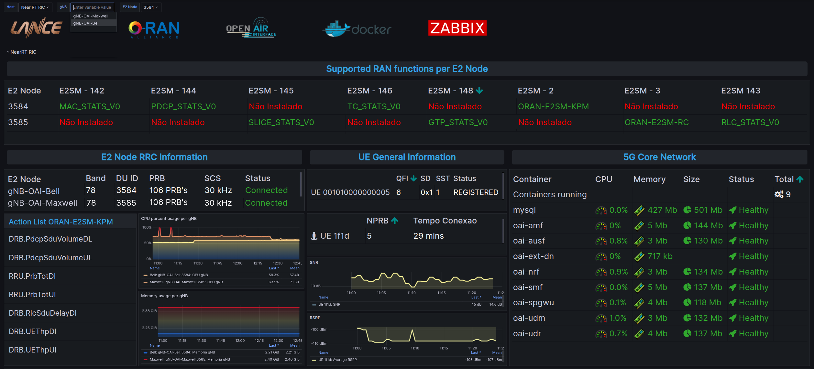

## Instalar Zabbix Agent

 > --hostname = Nome do Host/5GC/E2 Node, que desejamos monitorar

```bash
sudo ./install_zabbix_agent2.sh --hostname "HOST_NAME" --server "IP_ZABBIX-SERVER" --metadata "O-RAN"
```

> Após a instalação do Zabbix Agent o Host estará disponível no Zabbix Server

### Zabbix Hosts


> Agora também já é possível acompanhar as informações na dashboardo do Grafana

### Dashboard E2 Node

